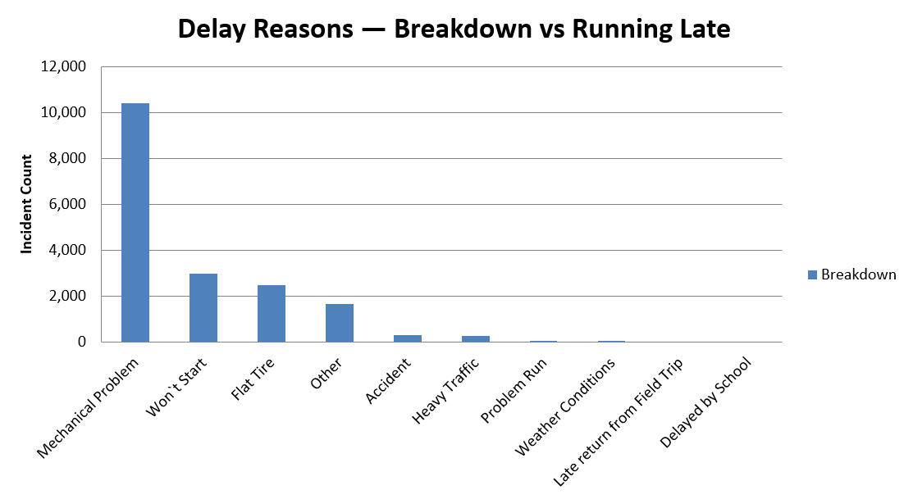
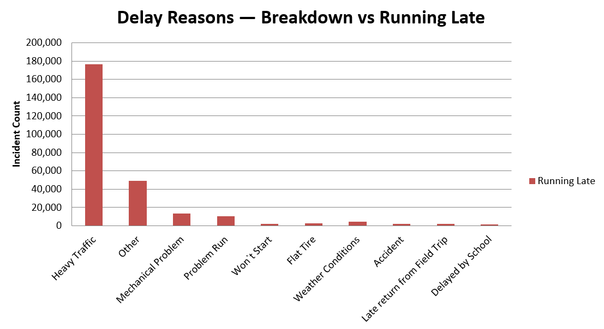
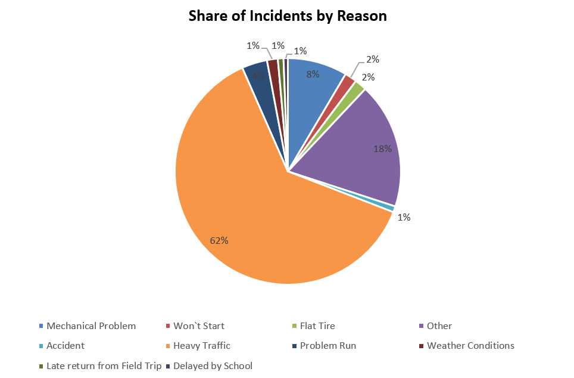
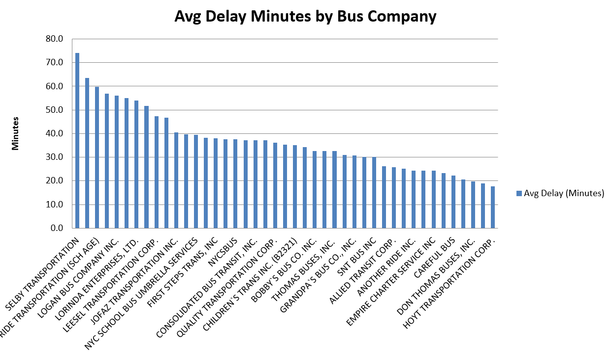
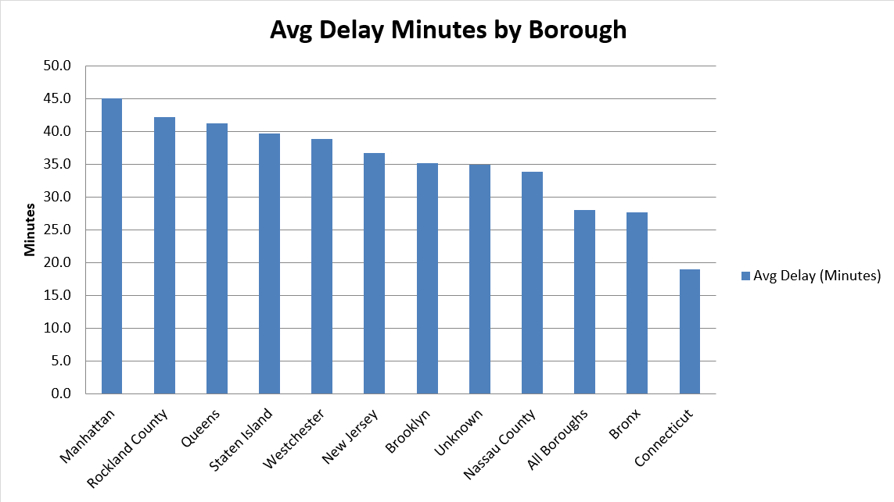
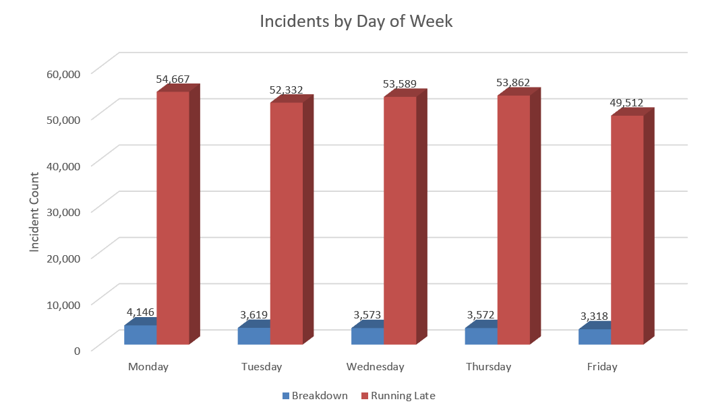
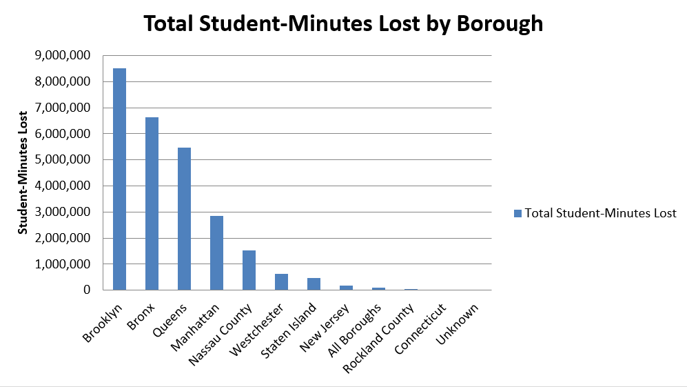
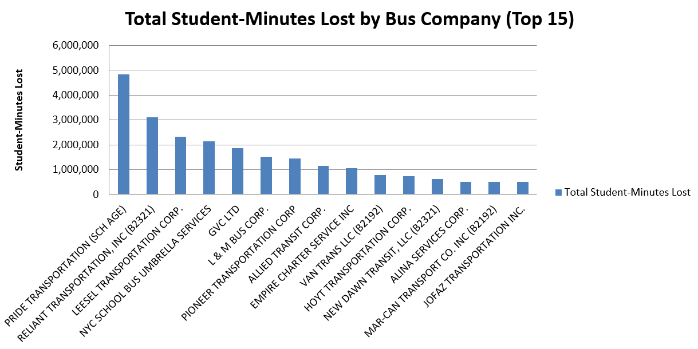
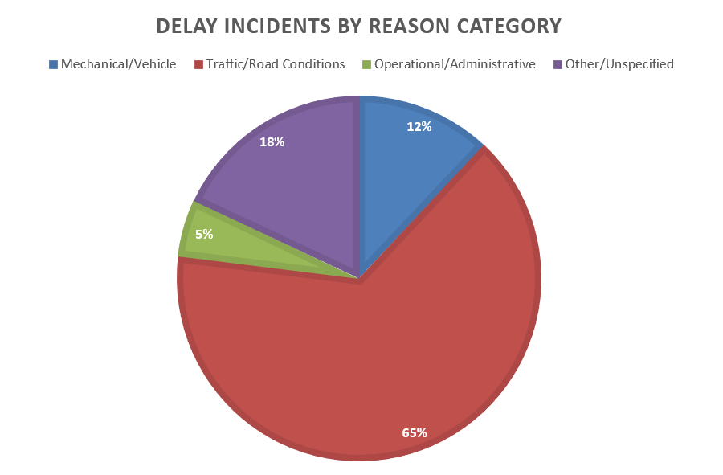
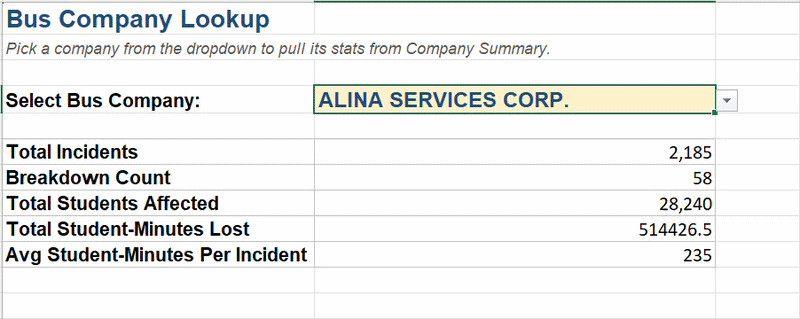

# NYC Bus Breakdown & Delay Analysis

This is an Excel-based data analysis project I built using the publicly available "Bus Breakdown and Delays" dataset (282,191 incident records) provided by the Department of Education via NYC Open Data. I built this project to demonstrate practical Excel data analysis skills using not just a dummy dataset, but a real-world dataset where I could actually answer practical questions and offer meaningful insights. To do so, I drew on my analytical skills — from data cleaning, through PivotTable-style aggregation, to formula-driven dashboards, interactive lookup tools, and more. Let me dive deeper into what exactly I did!

---

## Introduction

I built this project to give myself a real, end-to-end analytics exercise using a skill set I have actually used and learned so far: Excel formulas, PivotTables, VLOOKUP, XLOOKUP, visualization, data cleaning, and dashboard design. Based on job descriptions for various analytics roles, I found that when it comes to Excel, these are the skills most commonly mentioned, meaning analysts will use these skills on the job from day one. Rather than working with a dummy dataset, I used NYC's actual bus breakdown and delay records, which meant dealing with real-world messiness: 282K+ rows, inconsistent categories, missing values, and multiple valid ways to define "impact."

The scenario I framed for myself is this: **I've been hired by the NYC Division of Transportation as a Data Analyst**, tasked with identifying what's driving bus breakdowns and delays so the agency can prioritize fixes and further improve bus operations. That framing shaped every choice below.

I tried to answer the questions a transportation manager would actually ask, not just report raw counts.

What I did, at a high level:
- Cleaned and structured the raw dataset into a single, lean source table
- Built formula-driven summary tables (COUNTIFS, SUMIFS, SUMPRODUCT, AVERAGEIFS) answering three core research questions
- Designed a "Delay Burden" metric that weights incidents by how many students they actually affected, not just how often they happened
- Built a second workbook demonstrating VLOOKUP-based tools: an interactive company lookup panel and a reason-categorization system
- Charted every finding and pulled out the actual insights, not just the visuals

---

## Dashboard Files

| File | Description |
|---|---|
| 📊   [`Bus_Breakdown_and_Delays_NYC_Project_Final.xlsx`](./Bus_Breakdown_and_Delays_NYC_Project_Final.xlsx) | Part 1 — Core analysis: Common Delay Reasons, How Delay Times Vary, Day of Week, Delay Burden |
| 🔍  [`Bus_Breakdown_VLOOKUP_Analysis.xlsx`](./Bus_Breakdown_VLOOKUP_Analysis.xlsx) | Part 2 — VLOOKUP-driven tools: interactive Company Lookup panel + Reason Category mapping |

### Scenario

> You've been hired by the New York Division of Transportation as a Data Analyst with the primary goal of improving the efficiency and reliability of the city's bus transportation system. The city has been experiencing a significant number of bus breakdowns and delays, which has been causing inconvenience to commuters and straining the city's public transportation resources. Your task is to analyze the provided data to identify patterns and factors that contribute to these breakdowns and delays.

### Questions Solved

1. What are the most common reasons for delays and breakdowns?
2. How do delay times vary by bus company and borough?
3. Is there a correlation between specific days of the week and the frequency of breakdowns or delays?
4. Which boroughs and bus companies impose the greatest *student-time burden* from breakdowns/delays? *(self-directed extension)*

---

## Excel Skills Used

- **Formulas:** `COUNTIF` / `COUNTIFS`, `SUMIF`, `SUMPRODUCT`, `AVERAGEIFS`, `VLOOKUP`, `IFERROR`, `TEXT`
- **Data Validation** — dropdown-driven interactive search panel
- **Native Excel Charts** — stacked bar, clustered bar, pie charts with percentage data labels
- **Conditional formatting & professional styling** — consistent header styling, borders, tab colors, frozen panes
- **Data cleaning & structuring** — consolidating a sprawling multi-tab workbook into a single lean source table referenced by every downstream analysis (reduced file size from 119MB to 13MB by eliminating duplicated data across tabs)
- **Calculated metrics design** — building a custom "Student-Minutes Lost" burden metric that required row-level multiplication before aggregation (a case where `SUMPRODUCT` was necessary instead of a standard PivotTable calculated field, which would have produced a mathematically incorrect result)

---

## About the Dataset

The source data is the NYC DOE's Bus Breakdown and Delays dataset — one row per reported incident, originally 24 columns. For this analysis, I extracted and worked primarily with:

| Column | What it captures |
|---|---|
| `Reason` | The reported cause (Heavy Traffic, Mechanical Problem, Won't Start, etc.) |
| `Boro` | Borough or region where the incident occurred |
| `Bus_Company_Name` | The contracted bus operator (56 unique companies) |
| `Breakdown_or_Running_Late` | Whether the bus broke down entirely or was just delayed |
| `Number_Of_Students_On_The_Bus` | Students aboard at the time of the incident |
| `Short_Delay_Time_Estimate` / `Long_Delay_Time_Estimate` | Low/high estimate of delay length in minutes (only populated for "Running Late" incidents) |
| `Occurred_On` | Timestamp of the incident, used to derive day-of-week |

The goal wasn't just to report what's in these columns — it was to combine them into metrics that answer operational questions: which reasons actually cause full breakdowns vs. just delays, which companies are slow *and* carrying a lot of students, and whether there's a weekly rhythm to failures.

---

## Dashboard Build

All charts below are shown at a fixed 650px width for visual consistency, regardless of chart type.

### Part 1 — Core Analysis

**1. Common Delay Reasons — Breakdown**

**2. Common Delay Reasons — Running Late**

**3. Share of Incidents by Reason**

**Insight:** Heavy Traffic accounts for 62.5% of all incidents — nearly two-thirds — but it's overwhelmingly a *delay* problem, not a breakdown problem (only 279 of 176,475 Heavy Traffic incidents were actual breakdowns). Mechanical Problem is a much smaller slice of total volume (8.5%) but carries a far higher breakdown rate (43% of its incidents are true breakdowns) — meaning the reasons driving *frequency* aren't the same as the ones driving *vehicle failure*. An operations team optimizing for reliability should weight these very differently.

**4. How Delay Times Vary — by Bus Company**

**5. How Delay Times Vary — by Borough**

**Insight:** Manhattan has the longest average delay time (45.1 minutes) despite not having the highest incident volume — suggesting Manhattan routes face structurally worse traffic conditions per incident, not just more incidents. Delay severity by company varies meaningfully too, which matters for contract renewal decisions: a company with fewer incidents but longer average delays may be a worse actual experience for riders than a high-volume, low-severity company.

**6. Day of Week**

**Insight:** Monday is the worst day (58,813 total incidents), tapering steadily to Friday (52,830) — an 11% decline across the week. The pattern holds for both breakdowns and delays, which points to a systemic Monday effect (possibly weekend maintenance backlogs or traffic patterns) rather than random noise.

**7. Delay Burden — by Borough** *(self-directed metric)*

**8. Delay Burden — by Bus Company**

**Insight:** Raw incident counts don't reflect real-world impact — a delay affecting 3 students isn't the same as one affecting 60. Weighting by `Number_Of_Students_On_The_Bus × Delay_Minutes`, Brooklyn imposes the single greatest burden (8.5M student-minutes lost), even though Manhattan has more total incidents — because Manhattan incidents tend to involve fewer riders per bus. This reframes the priority order from "most incidents" to "most actual disruption," which is the metric an agency should really be optimizing against.

### Part 2 — VLOOKUP Analysis

**9. Reason Categories** *(via VLOOKUP against a custom mapping table)*

**Insight:** Grouping the 10 raw reason codes into 4 categories (Mechanical/Vehicle, Traffic/Road Conditions, Operational/Administrative, Other) shows Traffic/Road Conditions dominates at 65% — consistent with the Part 1 finding, but this grouping makes the "Other" bucket (18%) more visible as a real analytical gap worth investigating further (what's actually in "Other"?).

**10. Interactive Company Lookup Panel**

A dropdown (Data Validation) lets you select any of the 56 bus companies and instantly pull that company's full stat line — Total Incidents, Breakdown Count, Total Students Affected, Total Student-Minutes Lost, and Average Student-Minutes per Incident — via `VLOOKUP` against a pre-built Company Summary table. This turns a static report into a self-service tool: no filtering, no scrolling through 282K rows, just pick a name and read the answer.

---

## Formulas & Functions

| Formula | What it does |
|---|---|
| `=COUNTIF(range, criteria)` | Counts rows matching a single condition — e.g., how many incidents belong to a given borough. |
| `=COUNTIFS(range1, crit1, range2, crit2)` | Counts rows matching *multiple* conditions at once — e.g., how many *Breakdown* incidents happened in a specific borough. |
| `=SUMIF(range, criteria, sum_range)` | Sums a column, but only for rows matching a condition — e.g., total students affected per company. |
| `=SUMPRODUCT((cond)*rangeA*rangeB)` | Multiplies arrays element-by-element, then sums the results — the only way to compute `students × delay_minutes` *per row* before aggregating. A standard PivotTable calculated field would instead multiply the *totals* of each column, which is mathematically wrong here. |
| `=AVERAGEIFS(avg_range, range1, crit1, range2, crit2)` | Averages a column subject to multiple conditions — e.g., average delay minutes for a company, restricted to "Running Late" incidents only. |
| `=VLOOKUP(lookup_value, table_array, col_index, FALSE)` | Searches the first column of a table for an exact match, then returns a value from a specified column over. Powers both the Reason Category mapping and the interactive Company Lookup panel. `FALSE` forces an exact match — critical for text lookups like company names. |
| `=IFERROR(formula, fallback)` | Wraps a formula so that any error (e.g., `#DIV/0!` from dividing by a zero-incident count) returns a clean fallback value instead of an error message. |
| `=TEXT(date, "dddd")` | Converts a date/timestamp into its weekday name, used to derive `Weekday` directly from `Occurred_On` rather than trusting a pre-coded numeric field. |

---

## Conclusion

This project moved from raw, messy incident-level data to a set of formula-driven, decision-ready views — without ever hardcoding a result. Every number on every tab recalculates from the source data, which means the whole workbook stays correct if new incidents get appended later.

A few takeaways I'd highlight to an employer:
- **Frequency and severity aren't the same story** — Heavy Traffic is the most *common* reason, but Mechanical Problems are proportionally the most likely to cause a full breakdown.
- **Raw counts can mislead prioritization** — the Delay Burden metric shows that weighting by actual student impact reorders which boroughs and companies deserve the most attention.
- **A clean single source of truth matters** — consolidating everything into one lean data tab (rather than duplicating the dataset across every analysis tab) cut file size by 89% and made every formula easier to trust and maintain.

If I extended this further, I'd want to bring in year-over-year trend data (if available) to see whether these patterns are improving or worsening over time, and build out a response-time metric (time between `Created_On` and `Occurred_On`) to measure how quickly incidents get logged and addressed.
